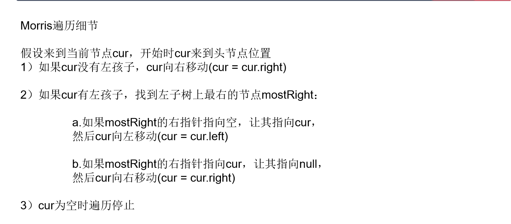
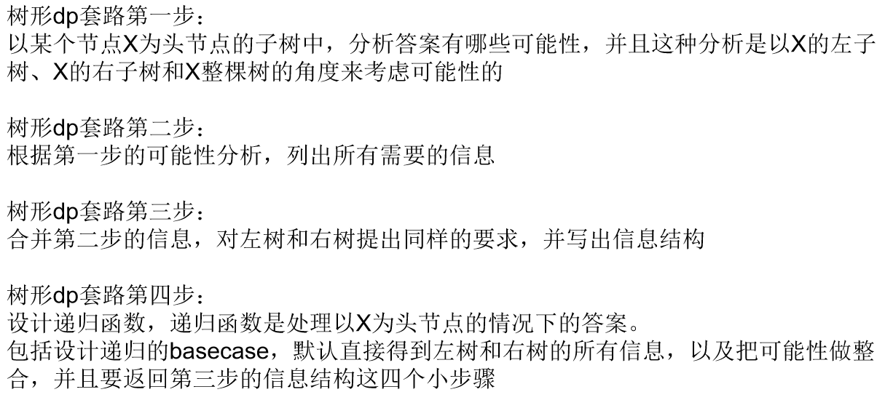

# 第四课

## 第四课第 4 题

单调栈应用
找到位置和为最小值，和最大的数组，单调栈 (O(n))

累加和数组可以通过前缀和数组解决：
3,2,1,4,2,3,5
3,5,6,10,12,15,20

## 第 5 课 Morris 遍历

通常方法会有 O(H) 的空间复杂度
以递归方法为例，压栈会有空间占用

Morris 时间复杂度依旧是 O(N), 空间复杂度会保证在 O(1)

利用了很对大量的底层指针

Morris 遍历细节可参考课件  


```C++
void morris(Node head) {
    if (head == null){
        return;
    }
    Node cur = head;
    Node mostRight = null;
    while(cur != null)
    {
        mostRight = cur.left;  // mostRight是cur左孩子
        if (mostRight != null){  //有左子树
            while(mostRight.right != null && mostRight.right != null){
                mostRight = mostRight.right;
            }
            //mostRight变成了cur左子树，最右节点。
            if(mostRight.right == null) { // 第一次来
                mostRight.right = cur;
                cur = cur.left;
                continue;
            } else { //这是第二此来到cur
                mostRight.right = null;
            }
        }
        // 无左子树
        // print(cur.value) 加这一行实现中序遍历
        cur = cur.right;
    }
}
```

空间复杂度 O(1), 时间复杂度：
遍历左子树右边界的问题。总代价还是 O(N).

Morris 改先序，中序。  
先序，来到节点第一次就打印  
中序，来到节点第二次打印（遍历两次），直接打印（遍历一次）  
后序遍历：  
1. 仅在能回到自己两次，且只在第二次打印。逆序打印左子树的右边界。
2. 遍历结束后，逆序打印树的右边界

如何逆序打印左子树右边界，有限指针  
看成单链表的逆序打印

## 树行 dp 套路

二叉树套路：


1. 抽取需要什么信息，定义数据结构。
2. 设计 basecase, 默认得到左右两部分内容，如何加工出结果
3. 常用 x 有关，x 无关 作为分析逻辑

其实就是后序遍历

注意: 如果需要回到一个点三次，即整合信息。此时不能用 Morris 遍历。

此类型题目为 *树行 DP* 题目。
